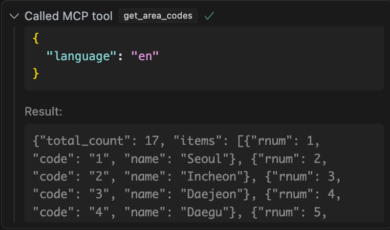

# 한국 관광 API MCP 서버 ✈️

<!-- Badges -->
[](https://smithery.ai/interface/@harimkang/mcp-korea-tourism-api)
[](https://badge.fury.io/py/mcp-korea-tourism-api)
[](https://opensource.org/licenses/MIT)
[](https://github.com/harimkang/mcp-korea-tourism-api/actions/workflows/ci.yml)


AI 어시스턴트 내에서 직접 대한민국 관광의 경이로움을 경험하세요! 이 프로젝트는 공식 한국관광공사(KTO) API를 기반으로 하는 모델 컨텍스트 프로토콜(MCP) 서버를 제공합니다. AI가 한국 전역의 활기찬 축제, 고요한 사찰, 맛있는 레스토랑, 편안한 숙박 시설 등을 발견할 수 있도록 지원합니다.

**링크:**
*   **PyPI 패키지:** [https://pypi.org/project/mcp-korea-tourism-api/](https://pypi.org/project/mcp-korea-tourism-api/)
*   **GitHub 저장소:** [https://github.com/harimkang/mcp-korea-tourism-api](https://github.com/harimkang/mcp-korea-tourism-api)
*   **릴리스:** [https://github.com/harimkang/mcp-korea-tourism-api/releases](https://github.com/harimkang/mcp-korea-tourism-api/releases)


## ✨ 특징

- **포괄적인 검색:** 키워드, 지역 또는 위치를 통해 관광지, 문화 유적지, 행사, 음식, 숙박, 쇼핑 정보를 찾아보세요.
- **풍부한 상세 정보:** 설명, 운영 시간, 입장료, 사진, 주소, 연락처 정보를 확인하세요.
- **위치 기반:** 특정 GPS 좌표 근처의 명소를 찾아보세요.
- **시기적절한 정보:** 날짜 범위를 기준으로 축제 및 행사를 찾아보세요.
- **다국어 지원:** KTO API에서 지원하는 다양한 언어(영어 포함)로 정보를 얻으세요.
    - **지원 언어**: 영어, 일본어, 중국어 간체, 중국어 번체, 러시아어, 스페인어, 독일어, 프랑스어
- **효율성 및 복원력:**
    - **응답 캐싱:** TTL(Time-To-Live) 캐싱을 사용하여 결과를 저장하고 중복 API 호출을 줄여 속도를 향상시킵니다.
    - **속도 제한:** API 사용 제한을 준수하여 오류를 방지합니다.
    - **자동 재시도:** 일시적인 네트워크 또는 서버 문제 발생 시 자동으로 요청을 재시도합니다.
- **MCP 표준:** 모델 컨텍스트 프로토콜을 지원하는 AI 어시스턴트와 원활하게 통합됩니다.

## ⚠️ 사전 준비 사항

시작하기 전에 **반드시** **한국관광공사(KTO) 데이터 포털**에서 API 키를 발급받아야 합니다.

1.  [KTO 데이터 포털](https://www.data.go.kr/) (또는 해당 관광 API의 특정 포털)을 방문합니다.
2.  "TourAPI" 서비스(예: `areaBasedList`, `searchKeyword`, `detailCommon` 등 정보 제공 서비스)에 대한 API 키를 등록하고 요청합니다.
3.  **서비스 키(API 키)**를 안전하게 보관합니다. 설치 또는 런타임 시 필요합니다.


> 각 언어별 요청을 위해서는 아래 API를 신청해야 합니다.
> * 영어: https://www.data.go.kr/data/15101753/openapi.do
> * 일본어: https://www.data.go.kr/data/15101760/openapi.do
> * 중국어 간체: https://www.data.go.kr/data/15101764/openapi.do
> * 중국어 번체: https://www.data.go.kr/data/15101769/openapi.do
> * 러시아어: https://www.data.go.kr/data/15101831/openapi.do
> * 스페인어: https://www.data.go.kr/data/15101811/openapi.do
> * 독일어: https://www.data.go.kr/data/15101805/openapi.do
> * 프랑스어: https://www.data.go.kr/data/15101808/openapi.do


## 🚀 설치 및 실행

`uv` (빠른 Python 패키지 설치 및 실행 도구) 또는 `Docker`를 사용하여 이 MCP 서버를 실행할 수 있습니다.

### Smithery를 통한 설치

[Smithery](https://smithery.ai/server/@harimkang/mcp-korea-tourism-api)를 통해 Claude 데스크톱용 한국 관광 API MCP 서버를 자동으로 설치하려면:

```bash
npx -y @smithery/cli install @harimkang/mcp-korea-tourism-api --client claude
```
### 옵션 1: `uv` 사용 (로컬 개발에 권장)

1.  **저장소 복제:**
    ```bash
    git clone https://github.com/harimkang/mcp-korea-tourism-api.git
    cd mcp-korea-tourism-api
    ```
2.  **API 키 환경 변수 설정:**
    `"YOUR_KTO_API_KEY"`를 발급받은 실제 키로 바꾸세요.
    ```bash
    # macOS/Linux
    export KOREA_TOURISM_API_KEY="YOUR_KTO_API_KEY"

    # Windows (명령 프롬프트)
    # set KOREA_TOURISM_API_KEY="YOUR_KTO_API_KEY"

    # Windows (PowerShell)
    # $env:KOREA_TOURISM_API_KEY="YOUR_KTO_API_KEY"
    ```
    *참고: 영구 저장을 위해 이 줄을 셸 설정 파일(예: `.zshrc`, `.bashrc`)에 추가하거나 시스템 환경 변수 설정을 사용하세요.*

3.  **의존성 설치 및 서버 실행:**
    이 명령어는 `uv`를 사용하여 `uv.lock` (사용 가능한 경우) 또는 `pyproject.toml`을 기반으로 의존성을 설치한 다음 서버 모듈을 실행합니다.
    ```bash
    uv run -m mcp_tourism.server
    ```
    서버가 시작되고 표준 입력/출력(stdio)을 통해 MCP 요청을 수신 대기합니다.

### 옵션 2: Docker 사용 (격리된 환경/배포에 권장)

1.  **저장소 복제:**
    ```bash
    git clone https://github.com/harimkang/mcp-korea-tourism-api.git
    cd mcp-korea-tourism-api
    ```
2.  **Docker 이미지 빌드:**
    `"YOUR_KTO_API_KEY"`를 발급받은 실제 키로 바꾸세요. 이 명령어는 제공된 `Dockerfile`을 사용하여 이미지를 빌드하며, API 키를 빌드 인수를 통해 안전하게 전달합니다.
    ```bash
    >>> docker build -t mcp-korea-tourism-api .

    [+] Building 2.7s (13/13) FINISHED                                                 docker:desktop-linux
    => [internal] load build definition from Dockerfile                                               0.0s
    => => transferring dockerfile: 1.46kB                                                             0.0s
    => resolve image config for docker-image://docker.io/docker/dockerfile:1                          0.9s
    => CACHED docker-image://docker.io/docker/dockerfile:1@sha256:4c68376a702446fc3c79af22de146a148b  0.0s
    => [internal] load metadata for docker.io/library/python:3.12-slim                                0.7s
    => [internal] load .dockerignore                                                                  0.0s
    => => transferring context: 864B                                                                  0.0s
    => [1/6] FROM docker.io/library/python:3.12-slim@sha256:85824326bc4ae27a1abb5bc0dd9e08847aa5fe73  0.0s
    => [internal] load build context                                                                  0.0s
    => => transferring context: 7.06kB                                                                0.0s
    => CACHED [2/6] RUN pip install --no-cache-dir uv                                                 0.0s
    => CACHED [3/6] WORKDIR /app                                                                      0.0s
    => CACHED [4/6] COPY pyproject.toml uv.lock ./                                                    0.0s
    => [5/6] RUN uv sync --frozen                                                                     0.8s
    => [6/6] COPY . .                                                                                 0.0s
    => exporting to image                                                                             0.1s
    => => exporting layers                                                                            0.1s
    => => writing image sha256:d7d074e85a66a257d00bad4043ea0f5ba8acf6b7c6ef26560c6904bf3ec4d5ff       0.0s 
    => => naming to docker.io/library/mcp-korea-tourism                                               0.0s

    >>> docker images

    REPOSITORY                              TAG                IMAGE ID       CREATED          SIZE
    mcp-korea-tourism                       latest             d7d074e85a66   12 seconds ago   215MB
    ```
    * `-t mcp-korea-tourism-api`: 빌드된 이미지에 `mcp-korea-tourism-api`라는 이름을 태그합니다.
    * `.`: 현재 디렉토리를 빌드 컨텍스트로 지정합니다.

3.  **Docker 컨테이너 실행:**
    테스트를 위해 대화형 모드로 실행하거나 백그라운드 작업을 위해 분리 모드로 실행할 수 있습니다.

    *   **대화형 모드 (수동 테스트용):**
        ```bash
        docker run --rm -it -e KOREA_TOURISM_API_KEY="YOUR_KTO_API_KEY" mcp-korea-tourism-api
        ```
        * `--rm`: 컨테이너가 종료될 때 자동으로 제거합니다.
        * `-it`: 대화형 모드로 실행하여 터미널을 컨테이너의 stdio에 연결합니다.
        * `-e KOREA_TOURISM_API_KEY=...`: 런타임에 API 키 환경 변수를 설정합니다(빌드 인수 대안).

    *   **분리 모드 (백그라운드용):**
        ```bash
        docker run --name tourism-mcp -d -e KOREA_TOURISM_API_KEY="YOUR_KTO_API_KEY" mcp-korea-tourism-api
        ```
        * `--name tourism-mcp`: 컨테이너에 이름을 할당합니다.
        * `-d`: 컨테이너를 분리(백그라운드) 모드로 실행합니다.
        * `docker logs tourism-mcp`를 사용하여 로그를 볼 수 있습니다.

## 🛠️ Cursor와 통합하기

Cursor 내에서 이 MCP 서버를 사용하려면:

1.  **Docker 컨테이너 실행 가능 확인:** 위의 Docker 설치 단계를 따라 이미지(`mcp-korea-tourism-api`)를 빌드합니다. 컨테이너를 수동으로 실행할 필요는 없습니다. Cursor가 알아서 합니다.
2.  **`mcp.json` 파일 찾기:** 이 파일은 Cursor용 MCP 도구를 구성합니다. 일반적으로 Cursor 설정이나 `~/.cursor/mcp.json`과 같은 경로에서 찾을 수 있습니다.
3.  **MCP 구성 추가 또는 업데이트:** `mcp.json` 파일 내 목록에 다음 JSON 객체를 추가합니다. 이 도구에 대한 항목이 이미 있는 경우 `command`를 업데이트합니다. `"YOUR_KTO_API_KEY"`를 실제 키로 바꾸세요.
    

    ```json
    {
        "mcpServers": {
            "korea-tourism": {
                "command": "docker",
                "args": [
                    "run",
                    "--rm",
                    "-i",
                    "-e",
                    "KOREA_TOURISM_API_KEY=YOUR_KTO_API_KEY",
                    "mcp-korea-tourism-api"
                ]
            }
        }
    }
    ```

    또는 uv 사용 [로컬 디렉토리]
    ```json
    {
        "mcpServers": {
            "korea-tourism": {
                "command": "uv",
                "args": [
                    "--directory",
                    "{LOCAL_PATH}/mcp-korea-tourism-api",
                    "run",
                    "-m",
                    "mcp_tourism.server"
                ],
                "env": {
                    "KOREA_TOURISM_API_KEY": "YOUR_KTO_API_KEY"
                }
            }
        }
    }
    ```

4.  **`mcp.json` 저장**.
5.  **Cursor 재시작 또는 MCP 도구 새로고침:** Cursor가 이제 도구를 감지하고 필요할 때 Docker를 사용하여 실행합니다.

## 🛠️ 제공되는 MCP 도구

이 서버는 AI 어시스턴트를 위해 다음과 같은 도구를 제공합니다:

1.  `search_tourism_by_keyword`: 키워드(예: "경복궁", "비빔밥")를 사용하여 관광 정보를 검색합니다. 콘텐츠 유형, 지역 코드로 필터링합니다.
    
2.  `get_tourism_by_area`: 지역 코드(예: 서울='1')로 관광 정보를 탐색합니다. 콘텐츠 유형, 시군구 코드로 필터링합니다.
    
3.  `find_nearby_attractions`: 특정 GPS 좌표(경도, 위도) 근처의 관광 명소를 찾습니다. 반경 및 콘텐츠 유형으로 필터링합니다.
    
4.  `search_festivals_by_date`: 지정된 날짜 범위(YYYYMMDD) 내에 열리는 축제를 찾습니다. 지역 코드로 필터링합니다.
    
5.  `find_accommodations`: 호텔, 게스트하우스 등을 검색합니다. 지역 및 시군구 코드로 필터링합니다.
    
6.  `get_detailed_information`: 콘텐츠 ID를 사용하여 특정 항목에 대한 포괄적인 상세 정보(개요, 이용 시간, 주차 등)를 검색합니다. 콘텐츠 유형으로 필터링합니다.
    
7.  `get_tourism_images`: 콘텐츠 ID를 사용하여 특정 관광 항목과 관련된 이미지 URL을 가져옵니다.
    
8.  `get_area_codes`: 지역 코드(시/도) 및 선택적으로 하위 지역(시군구) 코드를 검색합니다.
    

## ⚙️ 요구 사항 (`uv` 방법의 경우)

- Python 3.12 이상
- `uv` 설치됨 (`pip install uv`)

## 사용 예시

이 MCP와 통합된 AI 어시스턴트는 다음과 같은 쿼리를 처리할 수 있습니다:

*   "명동역 근처 식당 찾아줘."
*   "불국사 사진 보여줘."
*   "다음 달 부산에 축제 있어?"
*   "경복궁(콘텐츠 ID 264337)에 대해 더 자세히 알려줘." 